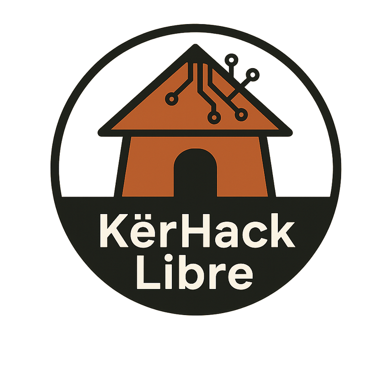

   


# BaseConv (bcv)

**bcv** (*Base Converter*) est un outil en ligne de commande simple, rapide et libre,  
conçu pour convertir des nombres entre différentes bases numériques :

- Binaire (2)
- Octale (8)
- Décimale (10)
- Hexadécimale (16)

> Développé par **KerHack-Libre**, dans un esprit **éducatif, local et pratique**,  
> pour aider chacun à acquérir une **base solide en numérisation informatique**.

---

## 🎯 Objectif du projet

Bcv se veut d'etre leger et simpliste  sans passer par d'outils lourds.
qui permet de faire: 

- Inspecter et déboguer des signatures de fichiers binaires
- Vérifier rapidement une valeur hexadécimale
- Visualiser un décalage binaire (`<<`, `>>`)
- Tester des expressions numériques shell

####  Dimension éducative

Comprendre les bases numériques, c’est comprendre la langue native des ordinateurs.

**bcv** a été conçu :

- Pour initier aux fondements du système de numérisation
- Pour visualiser concrètement les représentations numériques
- Pour renforcer les compétences bas niveau
- Pour établir une base solide de compétences à l’ère numérique

#### Fonctionnalités

- [x] Conversion instantanée entre bases 2, 8, 10, 16
- [x] Détection automatique des préfixes (`0b`, `0o`, `0x`)
- [x] Affichage des caractères ASCII imprimables (32 → 127)
- [x] Support des expressions shell :
```bash
bcv $((10 << 2))
```

- [x] Support des caractères entre guillemets :
```bash 
bcv "#"
```

- [x] Mode interactif amélioré
- [x] Sortie claire et structurée
- [x] Compact, rapide et sans dépendance externe

#### TODO 
- [ ] Different Format de sortie :
    - [ ] JSON
    - [ ] Yaml
    - [ ] XML
  
#### Architecture & Intégration

bcv repose sur une librairie C locale, développée sans dépendance externe.

Elle permet :
- Une intégration directe dans d'autres programmes
- Une architecture modulaire
- Une autonomie technologique totale

Ce n’est pas seulement un outil CLI,
c’est aussi un composant réutilisable.

##### Installation

######  Depuis la source

```bash
git clone https://github.com/KerHack-Libre/baseconv.git
cd baseconv

meson setup build 
meson install -C build
``` 


##### Utilisation 
###### ligne de commande 

```bash
bcv [OPTION] <NOMBRE> 

| Option         | Exemple     | Description              |
| :------------- | :---------- | :----------------------- |
| `-b <nombre>`  | `bcv -b 42` | Convertir en binaire     |
| `-o <nombre>`  | `bcv -o 42` | Convertir en octal       |
| `-x <nombre>`  | `bcv -x 42` | Convertir en hexadécimal |
| `-v`, `v`, `!` |             | Affiche la version       |
| `-h`, `h`, `?` |             | Affiche l’aide           |

``` 

###### Mode direct ou rapide 

```bash 
$ bcv 12
DEC : 12
HEX : 0xC
OCT : 0o14
BIN : 0b1100

$ bcv 0xFEED
DEC : 65261
OCT : 0o177355
BIN : 0b1111111011101101

$ bcv 33

DEC: 33
HEX: 0x21
OCT: 041
BIN: 0b100001
CHR: !
```

###### Expression shell
> bcv $((1 << 2))

###### Caractère ASCII
> bcv "U"

#### Mode Interactive 

Lancer simplement 
```bash 
bcv  
```
Puis entrer les commandes : 

```bash 
b/42       → convertit en binaire
x/255      → convertit en hexadécimal
o/77       → convertit en octal
exit       → quitte le shell
```

Une Page de manuel est incluse 

```bash  
man ./docs/bcv.1
```
Elle décrit en détail les options, les exemples et le fonctionnement du shell interactif. 

#### Exemple d’intégration Bash

```bash 
#!/bin/bash
# Exemple simple : conversion rapide dans un script
read -p "Entrer un nombre : " n
bcv $n
```


### Auteur & Mainteneur
Umar Ba [jUmarB@protonmail.com](jUmarB@protonmail.com)
_KerHack-Libre_ : “**comprendre**, **construire**, **transmettre**.”
</br>

#### ⚖️ Licence

Copyright (c) 2025
KerHack-Libre — Logiciel libre et distribué sans AUCUNE GARANTIE.
_L’ensemble des projets de KërHack-Libre sont distribués sous GPLv3,
en accord avec les **4 libertés fondamentales du logiciel libre**_

#### Contribuer

Les contributions sont toujours les bienvenues !
Si tu veux participer :

* Ouvre une issue pour proposer une amélioration
* Soumets une pull request
* Ou simplement partage bcv avec d’autres passionnés du shell !



